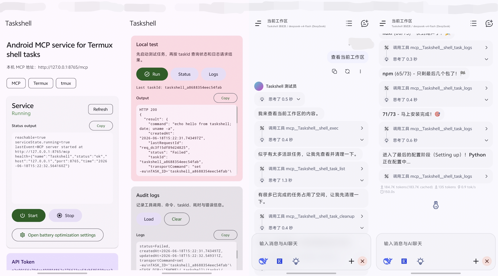

<p align="center">
  
</p>

<h1 align="center">Taskshell</h1>

<p align="center">
  <strong>A local MCP shell service for Android that wraps Termux command execution into backgroundable, queryable, and auditable task tools.</strong>
</p>

<p align="center">
  <code>com.wmdhs.taskshell</code>
</p>

<p align="center">
  
</p>

---

**Taskshell** is an Android MCP service that lets MCP clients run shell tasks through **Termux**.

It exposes a local MCP-compatible HTTP endpoint, forwards tool calls to Termux via `RUN_COMMAND`, and runs shell commands as `tmux`-backed tasks so long-running commands can continue even if the MCP request disconnects.

---

## Features

- Android native app written in **Kotlin + Jetpack Compose**.
- Local-only MCP HTTP server using Ktor/CIO:
  - `http://127.0.0.1:8765/mcp`
- API Token authentication.
- Termux integration through `com.termux.RUN_COMMAND`.
- `tmux`-backed background task model.
- Task logs and status files under Termux:
  - `~/.taskshell/tasks/<taskId>/`
- Foreground service with persistent notification.
- Boot receiver skeleton.
- Basic command safety policy.
- Concurrent task limiting.
- Privacy-aware audit logs with command previews, lengths, and hashes instead of full command text by default.
- Task cleanup tool.
- Task recovery from Termux task directories after Taskshell restart.

---

## Architecture

```text
MCP Client
    │
    │ Streamable HTTP / JSON-RPC
    ▼
Taskshell Android App
    │
    │ Local HTTP server on 127.0.0.1:8765
    ▼
MCP Tool Registry
    │
    │ Termux RUN_COMMAND Intent
    ▼
Termux
    │
    │ tmux new-session
    ▼
Shell task directory
~/.taskshell/tasks/<taskId>/
```

Each task directory contains files such as:

```text
command.sh
stdout.log
stderr.log
status
exit.code
started_at
ended_at
```

---

## Requirements

### Android

- Android 8.0+ recommended.
- Notification permission on Android 13+.
- Battery optimization should be disabled for better stability.

### Termux

Use a recent Termux build, preferably from F-Droid or GitHub.

Install `tmux`:

```bash
pkg update
pkg install tmux
```

Enable external command execution:

```bash
mkdir -p ~/.termux
printf 'allow-external-apps = true\n' >> ~/.termux/termux.properties
```

Then fully restart Termux.

---

## MCP client setup

1. Install and open Taskshell.
2. Tap **Start**.
3. Grant:
   - notification permission, if requested;
   - Termux `RUN_COMMAND` permission, if requested.
4. Copy the authorization header from Taskshell:

```http
Authorization: Bearer <token>
```

5. Add an MCP server in your MCP client:

```text
Type: Streamable HTTP
URL:  http://127.0.0.1:8765/mcp
Header: Authorization: Bearer <token>
```

If your MCP client caches old tool definitions, delete and recreate the MCP entry after updating Taskshell.

---

## MCP tools

Taskshell uses underscore-only tool names for compatibility with clients that reject dots in function names.

| Tool | Description |
|---|---|
| `shell_exec` | Run a short shell command and return concise stdout, stderr, exit code, truncation flags, and taskId. If it keeps running, return taskId for follow-up. Supports `env`, `stdin`/`input`, and `timeoutMillis`. |
| `shell_task_start` | Start a tmux-backed background task and return a concise task summary. Supports `env`, `stdin`/`input`, `timeoutMillis`, and optional `includeCommand`. |
| `shell_task_status` | Query concise task status, timestamps, duration, running flag, exit code, and command summary. Full command is returned only when `includeCommand=true`. |
| `shell_task_logs` | Read split stdout/stderr from a task with `maxLines`, `maxBytes`, and truncation flags. |
| `shell_task_stop` | Stop a task by killing its tmux session and return concise final status. |
| `shell_task_list` | List known tasks with concise summaries. |
| `shell_task_cleanup` | Clean old finished task records and Termux task directories. Maintenance tool; dry-run by default. |
| `shell_task_recover` | Recover task records from `~/.taskshell/tasks`. Use after service restart or missing task records. |
| `shell_task_debug` | Advanced per-task diagnostics, including Termux transport and raw callback details. Use only when normal task tools fail. |
| `audit_logs` | List recent in-memory audit events for troubleshooting. |
| `audit_clear` | Clear in-memory audit events. |
| `service_diagnostics` | Advanced service lifecycle and Termux transport diagnostics. Use only when normal tools fail. |

### MCP output design

Taskshell separates normal task results from diagnostics.

Normal tools return concise, stable, task-oriented results and avoid exposing Termux transport internals:

```text
shell_exec
shell_task_start
shell_task_status
shell_task_logs
shell_task_stop
shell_task_list
```

Diagnostic tools are intended for troubleshooting and may expose implementation details:

```text
shell_task_debug
shell_task_recover
shell_task_cleanup
audit_logs
service_diagnostics
```

Example `shell_exec` result for a completed command:

```json
{
  "status": "finished",
  "taskId": "taskshell_xxxxxxxxxxxxxxxx",
  "exitCode": 0,
  "stdout": "hello",
  "stderr": "",
  "stdoutTruncated": false,
  "stderrTruncated": false,
  "nextActions": ["shell_task_logs"]
}
```

Example result when the command continues in background:

```json
{
  "status": "running",
  "taskId": "taskshell_xxxxxxxxxxxxxxxx",
  "message": "Command is still running. Use shell_task_status or shell_task_logs to continue.",
  "nextActions": ["shell_task_status", "shell_task_logs", "shell_task_stop"]
}
```

### `shell_exec`

Example:

```json
{
  "command": "echo hello",
  "cwd": "/data/data/com.termux/files/home",
  "waitMillis": 10000
}
```

Input options example:

```json
{
  "command": "cat; echo FOO=$FOO",
  "cwd": "/data/data/com.termux/files/home",
  "env": {
    "FOO": "bar"
  },
  "stdin": "hello from stdin\n",
  "timeoutMillis": 5000,
  "waitMillis": 10000
}
```

### `shell_task_start`

Example:

```json
{
  "command": "pwd; echo hello from taskshell; date",
  "cwd": "/data/data/com.termux/files/home",
  "includeCommand": false
}
```

Accepted working directory parameter aliases:

```text
cwd
workingDirectory
workdir
working_dir
```

### `shell_task_status`

```json
{
  "taskId": "taskshell_xxxxxxxxxxxxxxxx",
  "includeCommand": false
}
```

### `shell_task_logs`

```json
{
  "taskId": "taskshell_xxxxxxxxxxxxxxxx",
  "maxLines": 200,
  "maxBytes": 65536
}
```

### Command privacy

Task summaries and status results do not return the full command by default. They return:

```json
{
  "command": null,
  "commandPreview": "echo hello ...",
  "commandLength": 123,
  "commandSha256": "..."
}
```

Set `includeCommand=true` only when the client really needs the full command text.

### Input limits

Current input-related limits:

| Parameter | Limit |
|---|---|
| `env` | Up to 64 variables; names must match `^[A-Za-z_][A-Za-z0-9_]*$`; each value up to 8192 characters. |
| `stdin` / `input` | Up to 256 KiB. |
| `timeoutMillis` | `1` to `86400000` ms. Requires `timeout` in Termux; install `coreutils` if unavailable. |
| `maxLines` | `1` to `5000`. |
| `maxBytes` | `1024` to `1048576` bytes per output stream. |
| `waitMillis` | `0` to `30000` ms. |

### `shell_task_cleanup`

Dry-run first:

```json
{
  "olderThanHours": 24,
  "keepLatest": 20,
  "dryRun": true
}
```

Actually delete:

```json
{
  "olderThanHours": 24,
  "keepLatest": 20,
  "dryRun": false
}
```

---

## Debug HTTP endpoints

Taskshell also exposes debug endpoints on the same local server.

```text
GET  /health
GET  /tools
POST /tools/call
POST /mcp
```

`/health` does not require authentication. Other endpoints require either:

```http
Authorization: Bearer <token>
```

or:

```http
X-Taskshell-Token: <token>
```

---

## Safety policy

Taskshell is intentionally conservative.

Current defaults:

- Max command length: `8000` characters.
- Max stdin/input length: `256 KiB`.
- Max env variables: `64`; each value up to `8192` characters.
- Max command timeout: `24 hours`.
- Allowed working directory prefixes:
  - `/data/data/com.termux/files/home`
  - `/data/data/com.termux/files/usr/tmp`
- Max active tasks: `3`.
- Max heavy tasks: `1`.
- Max known in-memory tasks: `50`.
- Finished/failed/stopped in-memory records are cleaned after 24 hours.

Blocked high-risk patterns include:

```text
su
reboot
shutdown
setprop
settings
pm uninstall
dd ... of=/dev/...
mkfs
rm -rf /
rm -rf /data
rm -rf /sdcard
rm -rf $HOME
rm -rf ~
```

This is not a security sandbox. Treat every connected MCP client as highly privileged.

---

## Task recovery behavior

Termux task files are the source of truth.

If Taskshell is killed but Termux and `tmux` continue running, the task directory can remain available:

```text
~/.taskshell/tasks/<taskId>/
```

After reopening Taskshell, use:

```text
shell_task_recover
```

or call `shell_task_recover` explicitly before querying older task IDs.

Recovered tasks may show:

```text
command = <recovered from Termux task directory>
workingDirectory = null
```

because older task directories do not yet store structured metadata.

---

## Testing

Run JVM unit tests and Android lint:

```bash
gradle testDebugUnitTest lintDebug
```

Current unit tests cover command policy basics, task log parsing, and command preview/hash helpers.

---

## Build from source

Requirements:

- JDK 17
- Android SDK
- Gradle

Build debug APK:

```bash
gradle assembleDebug
```

Output:

```text
app/build/outputs/apk/debug/app-debug.apk
```

Current Android config:

```text
minSdk: 26
targetSdk: 35
compileSdk: 35
Kotlin: 2.0.21
Android Gradle Plugin: 8.7.3
Compose BOM: 2024.12.01
```

---

## Known limitations

- Audit logs are currently in-memory and store command summaries by default, not full command text.
- Task metadata recovery is partial unless metadata files are added in future versions.
- Android vendor ROMs may still kill background processes aggressively.
- Persistent notifications may be hidden or restricted by some vendor notification settings.
- `tmux` protects tasks from connection drops, not from Termux being killed by Android.

---

## Security warning

Taskshell gives an MCP client the ability to run shell commands in Termux.

Recommendations:

- Keep listening address as `127.0.0.1`.
- Do not expose Taskshell directly to public networks.
- Use the API Token.
- Review audit logs.
- Avoid granting access to untrusted MCP clients.
- Prefer VPN/tunnel solutions such as WireGuard/Tailscale if remote access is needed.

See [SECURITY.md](SECURITY.md).

---

## Roadmap

- Persist audit logs with Room or DataStore.
- Store structured task metadata.
- Improve recovery fidelity.
- Add configurable task limits and policies in UI.
- Better MCP Streamable HTTP compatibility tests.
- Signed release workflow.

---

## License

Taskshell is released under the [MIT License](LICENSE).
